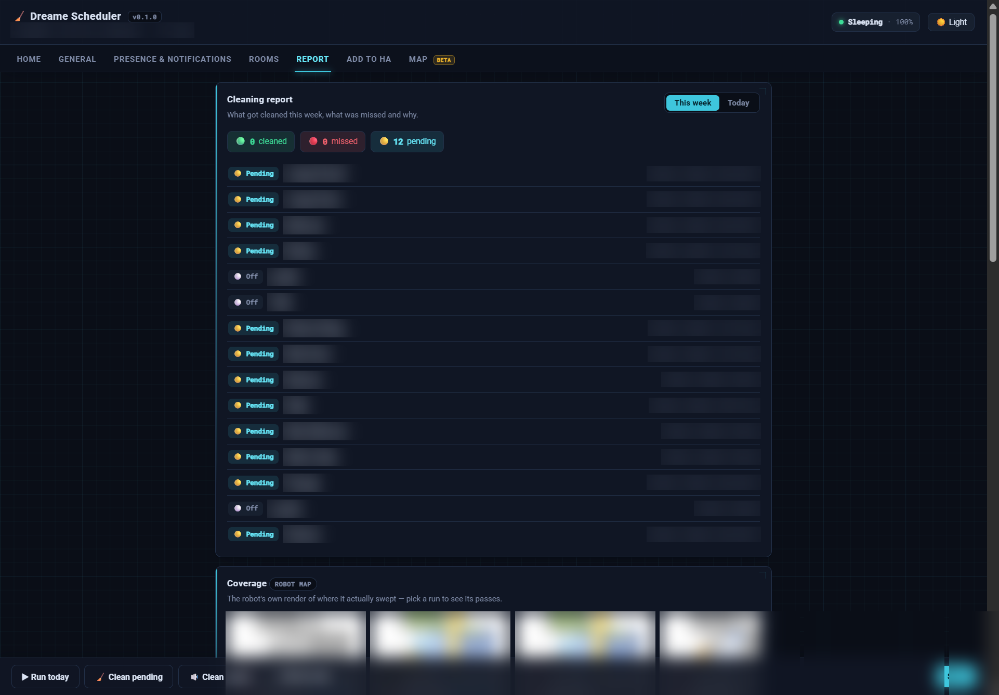

  

  <strong>Presence-aware, per-room cleaning scheduler for any Dreame robot vacuum in Home Assistant.</strong>

  
  
  

Schedule cleaning per room and per weekday, only when nobody's home, with a
weekly whole-house guarantee — all driven by the entities the
[Tasshack `dreame_vacuum`](https://github.com/Tasshack/dreame-vacuum) integration
already exposes. A meta-integration: it works with any model and needs no
rooting. One config entry per robot; add it again for a second vacuum.

## Highlights

| 🏠 Cleans when you're out | 📊 Tells you what happened | 🛟 Frees a stuck robot |
|---|---|---|
| Gates on your presence entities with a grace delay, and steps aside to the dock the moment someone comes home — resuming once the house is empty again. | A weekly report of what got cleaned, what was missed and _why_ — with the robot's own coverage renders, flagged obstacles, and a run-history trend. | If it wedges mid-clean, the scheduler walls off the spot, backs it out, and carries on — instead of leaving it stranded and the run half-done. |

## Screenshots

The companion **Dreame Scheduler** add-on gives you a full panel _(floor-plan details blurred for privacy)_:

_Overview — robot status, next run, this week's progress, suggestions and coverage._

_Floor Plan Studio (beta) — draw no-go / no-mop zones and virtual walls, auto-fit &amp; weld rooms, a live 3D view, and export to your own dashboard._

_Report — per-room status this week, why rooms were missed, and the robot's own coverage renders._

## What it does

- **Clean when nobody's home** — gate on `person`/`device_tracker`/`group`
  entities, with a grace delay so it doesn't launch the moment you leave.
- **Per-room schedule** — assign each room to specific weekdays, with its own
  cleaning mode / suction / mop wetness (discovered live from your vacuum).
- **Weekly whole-house guarantee** — tracks what's been cleaned since the start
  of the week and, on your catch-up day, finishes whatever's still pending.
- **Time window** — only run within an allowed window (e.g. 09:00–16:00), with
  optional overrun so a clean already running can finish.
- **Station guards** — defer if the dust bag is full, water needs attention, or
  the robot has a genuine fault (harmless maintenance reminders don't block).
- **Return & resume on arrival** — if someone comes home mid-clean the robot
  retreats to the dock, and resumes the remaining rooms once the house is empty
  again. State is persisted, so it survives restarts.
- **Stale-house nudge** — if people are always home and it hasn't cleaned in a
  while, it nudges you to run it while home — with a one-tap **Quiet** option.
- **Accurate coverage** — completion is detected from the robot's own
  `cleaning_count` metric, and skipped rooms come from the cleaning history's
  `blocked_rooms` (door/obstacle) — never from the unreliable "Task completed"
  text. Blocked rooms stay pending and are retried.

## Entities

| Entity | Purpose |
|---|---|
| `switch.…_scheduler_enabled` | Master on/off (state persists) |
| `sensor.…_status` | idle / running / waiting / disabled + rich attributes |
| `sensor.…_rooms_cleaned_this_week` | Weekly whole-house progress |
| `button.…_clean_now` / `…_clean_now_quiet` | Run pending rooms now (nudge targets) |
| `button.…_run_today_s_schedule_now` | Run today's scheduled rooms now |
| `button.…_reset_week_counters` | Start a fresh tracking week |

### Services

| Service | Purpose |
|---|---|
| `dreame_scheduler.run_scheduled_now` | Clean today's scheduled rooms now |
| `dreame_scheduler.run_catchup_now` | Clean everything still pending this week |
| `dreame_scheduler.reset_week` | Start a fresh tracking week |
| `dreame_scheduler.clean_rooms` | Clean specific room segments now (tap-a-room) |
| `dreame_scheduler.get_config` / `set_config` | Read/write config — used by the add-on GUI |
| `dreame_scheduler.get_report` | Weekly report data — used by the add-on GUI |

Each accepts an optional `vacuum` target; omit it in a single-robot home.

## Companion add-on

The **Dreame Scheduler** add-on is a config panel (behind ingress) for
everything here, plus a report view, ready-to-paste dashboard cards and the
optional Floor Plan Studio. It's a separate install — see
[dreame-scheduler-addon](https://github.com/botts7/dreame-scheduler-addon).
The integration works fully without it (via the options flow and services).

## Lovelace card

`www/dreame-scheduler-card.js` provides `dreame-scheduler-card`,
`dreame-robot-card` and `dreame-presence-card`. HACS installs the integration's
Python but **does not copy `www/`** — copy that file to `/config/www/` yourself
and add it as a dashboard resource (`/local/dreame-scheduler-card.js`), or use
the add-on's **Add to HA** tab which generates the cards with your entity ids.

## Install (HACS)

1. HACS → ⋮ → **Custom repositories** → add this repo, category **Integration**.
2. Install, restart Home Assistant.
3. **Settings → Devices & Services → Add Integration → Dreame Scheduler**, pick
   your vacuum.
4. Open the integration's **Configure** to set presence, window, and per-room
   schedules.

Requires Home Assistant **2025.12+** and the `dreame_vacuum` integration.

## Troubleshooting

### A room is skipped every run as "Blocked by door" — but there is no door

If one room chronically fails with rotating excuses in the Dreame app / cleaning
history ("Blocked by door", "Blocked by threshold", "Blocked by obstacle"), and
there's no actual door, the usual culprit is **phantom floor**: during mapping,
the lidar scanned *through windows* (or glass doors / mirrors) and painted
outdoor area as part of the room's segment. The robot cleans the real floor,
then tries to path into floor that doesn't exist, fails, and reports the whole
room blocked — so the scheduler keeps it pending forever.

How to confirm: in the map, look for room floor the robot has **never** left a
path trace on, typically fanning out past an exterior wall. The robot may also
drop a "Blocked Room" marker (visible in `camera.…_map`'s `obstacles`
attribute) inside the room.

Fix: draw **no-go zones over the phantom area** (Dreame app, or
`dreame_vacuum.vacuum_set_restricted_zone` — note it *replaces* the full zone
list, so include existing zones). Cover everything beyond the real wall; once
the robot stops attempting unreachable floor, the room completes normally.
Editing the room shape itself usually can't remove the artifact, and re-mapping
just scans the windows again.

### Rooms marked skipped/cleaned wrongly when the robot docks mid-run

Dreame robots dock **mid-task** to wash the mop or recharge, log a *partial*
history record (`completed: false`), and then head back out. The scheduler
holds the run open through these dock visits: it never finalises while the
robot reports an active task, treats a `completed: false` record as "will
resume" (waiting up to 30 min parked before giving up), and only banks a
room as cleaned from a `completed: true` record or from actually seeing the
robot enter it. If you're on a version before this logic (< 2026-07), a
mid-run dock visit could mis-mark the not-yet-cleaned rooms as skipped — or
credit rooms the robot never reached.

## Status

v0.1.0 — core verified live (config/options flow, room discovery, dispatch,
metric-based completion). Full run-to-completion + door/interrupt end-to-end
verification in progress.

### Roadmap
- Vacuum-before-mop ordering (sweep-then-mop / two-phase whole-house) to avoid
  smearing.
- Map-based partial resume — continue only the un-cleaned area after an
  interrupt, instead of redoing whole rooms.

## License

MIT
